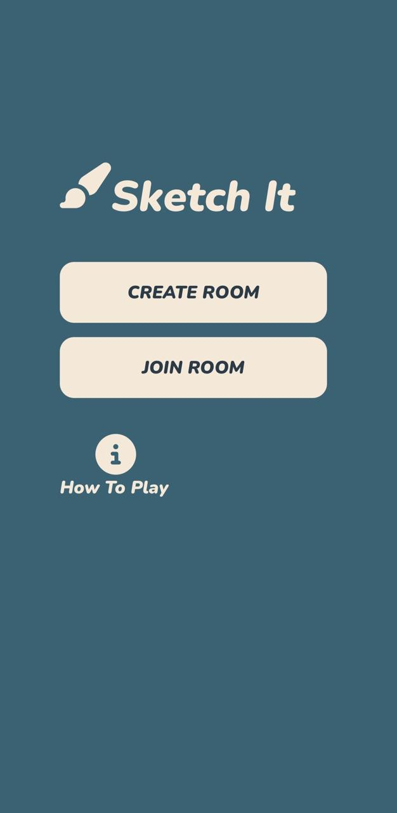
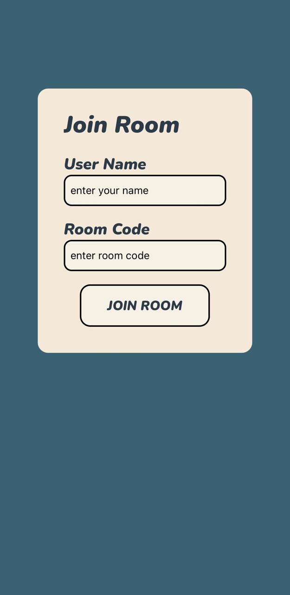
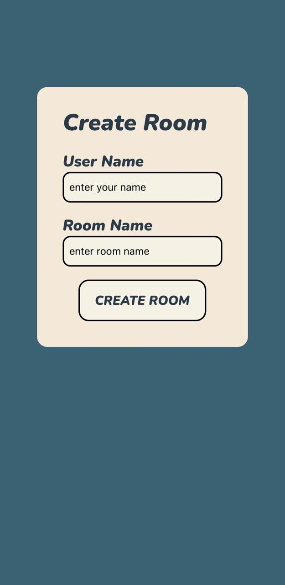
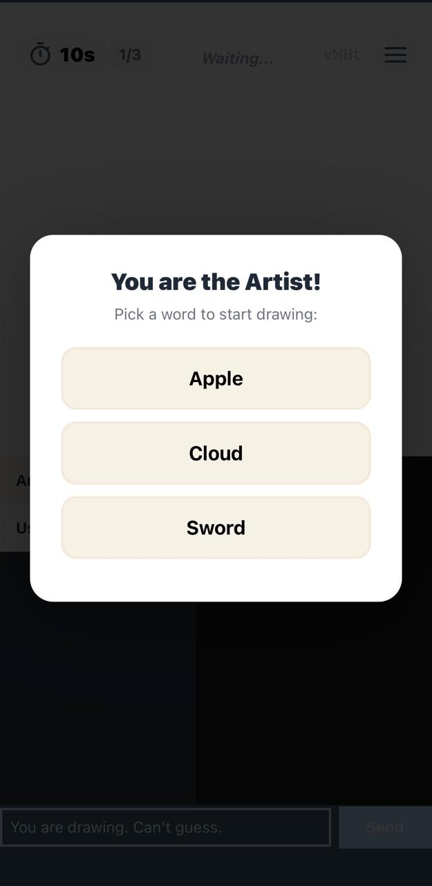
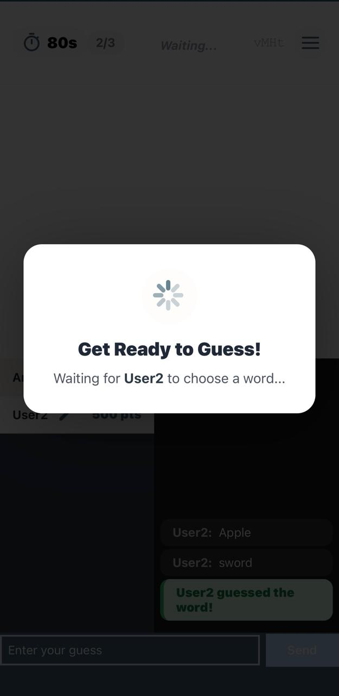
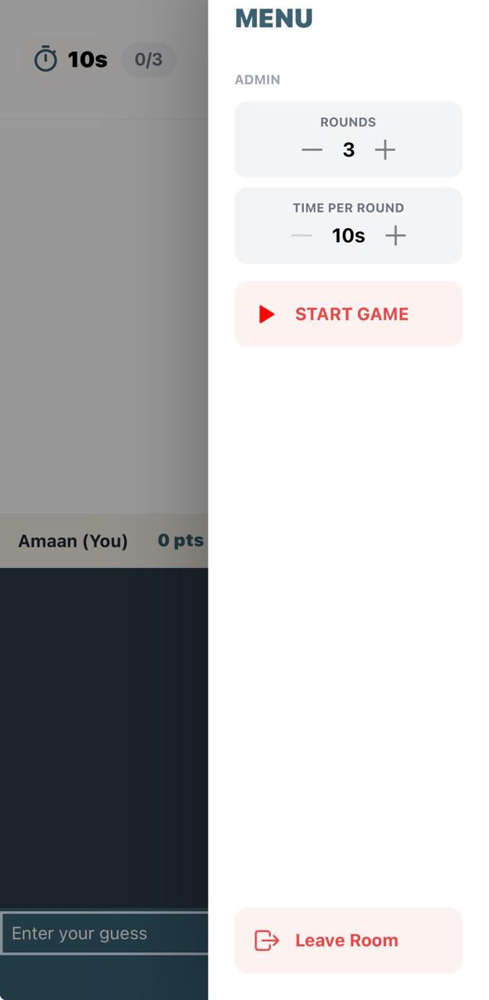
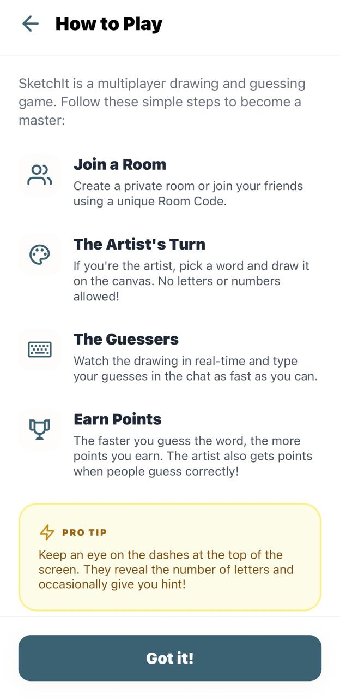
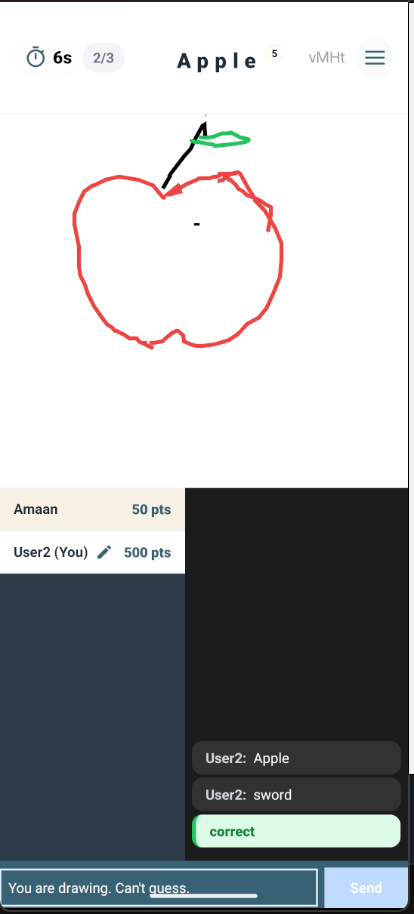
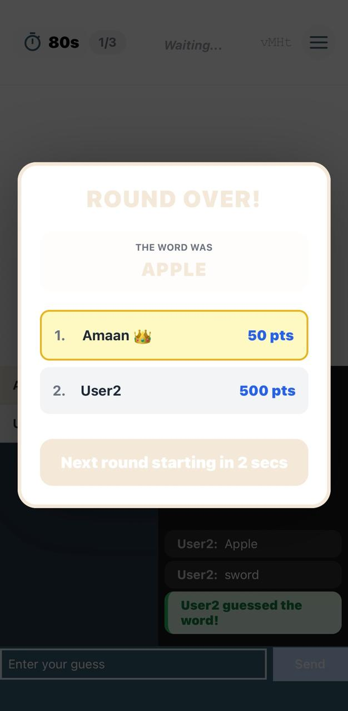

# 🎨 SketchIT

**A High-Performance Real-Time Multiplayer Drawing & Guessing Game**

SketchIT is a full-stack, mobile social game built for real-time collaboration. Players join virtual rooms where one person draws a secret word using a performant Skia canvas, while others compete to guess it first through a "fuzzy-matching" intelligent chat system.

---

## 🚀 Key Features

- **Real-Time Collaborative Drawing:** Low-latency stroke streaming powered by **Socket.io** and **React Native Skia**.
- **Intelligent Guess Verification:** Uses the **Levenshtein Distance** algorithm to detect "close" guesses and typos, providing private feedback to players.
- **Dynamic Scoring System:** Tiered points (500/300/100) based on how quickly you guess, with artist rewards for successful communication.
- **Role-Based UI:** Seamlessly switches between Artist (with drawing tools) and Guesser (with spectating mode and interactive chat).
- **Multiplayer Lobby & Room Management:** Private room creation with unique codes and real-time participant synchronization via **Redis**.
- **Anti-Spoiler Logic:** Automated chat filtering that hides correct answers from other players while the round is still active.

---

## 🛠️ Technical Stack

### **Frontend**

- **Framework:** React Native (Expo)
- **Canvas Engine:** `@shopify/react-native-skia`
- **Styling:** NativeWind (Tailwind CSS)
- **State Management:** Context API & React Hooks

### **Backend**

- **Runtime:** Node.js (TypeScript)
- **Communication:** Socket.io (WebSockets)
- **Storage/Caching:** Redis (Room state & Participant persistence)
- **Logic:** Custom game-flow handlers and string similarity algorithms

---

## 🧠 Technical Deep Dive

### **Fuzzy Match Verification**

SketchIT doesn't just look for exact strings. It implements a **String Similarity Pipeline** that normalizes input and calculates the edit distance between a guess and the answer.

- **Correct (Green):** Exact match.
- **Close (Yellow):** Guess is within a distance of 1-2 edits (typo detection).
- **None (White):** Standard chat message.

### **The Drawing Sync Architecture**

To ensure the guesser sees the drawing "live" without lagging the server, SketchIT utilizes a **Streaming Stroke Model**. Instead of sending the entire drawing at once, individual coordinates are emitted during the `onPanResponderMove` event, providing a 60fps-like experience for all participants.

## 📸 Screenshots

### 🏠 Onboarding & Lobby

|                       Main Page                       |                         Join Room                         |                         Create Room                         |
| :---------------------------------------------------: | :-------------------------------------------------------: | :---------------------------------------------------------: |
|  |  |  |

### 🎮 Gameplay Experience

|                       Artist View                       |                       Guesser View                       |                       Admin Settings                       |
| :-----------------------------------------------------: | :------------------------------------------------------: | :--------------------------------------------------------: |
|  |  |  |

### 🏁 Game Flow & Instructions

|                        How to Play                         |                      Drawing Canvas                       |                         Round Over                          |
| :--------------------------------------------------------: | :-------------------------------------------------------: | :---------------------------------------------------------: |
|  |  |  |
